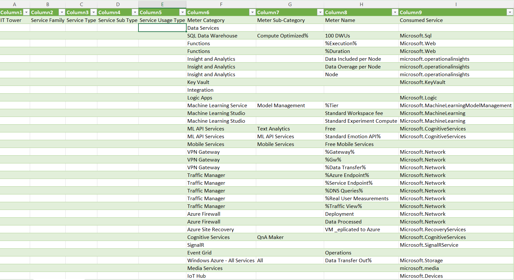

# Команда Одуванчики
## Состав:
1. Комелин Глеб
2. Скирляк Ярослав
3. Золотых Лев
4. Кабдулвахитов Эмир

## Цель работы:
Знакомство с облачными сервисами. Понимание уровней абстракции над инфраструктурой в облаке. Формирование понимания типов потребления сервисов в сервисной-модели. Сопоставление сервисов между разными провайдерами. Оценка возможностей миграции на отечественные сервисы.
## Дано:
Слепок данных биллинга от провайдера после небольшой обработки в виде SQL-параметров. Символ % в начале/конце означает, что перед/после него может стоять любой набор символов.

Google с документациями провайдера

## Начальные данные:
***Microsoft SQL Server*** - это реляционная система управления базами данных. Приложение подключается к экземпляру или базе данных SQL Server и взаимодействуют с помощью Transact-SQL.

***SQL Data Warehouse*** - Управляемое хранилище данных

***Functions*** - это сервис для создания и администрирования веб-приложений. Позволяет масштабировать и автоматизировать развёртывание 

***Microsoft.Web*** - это сервиc, предназначенный   для разработки, развертывания и управления веб-приложениями и ресурсами в облаке Azure. 

***Insight and Analytics*** - сервис, собирающий данные о работе серверов для управления производительностью приложений.

***Key Vault*** - сервис, предназначенный для хранения ключей и секретов, а также предоставляет возможность их шифровки

***Machine Learning*** - облачный сервис для развертывания моделей машинного обучения, основными преимуществами являются: легкое создание и тестирование, обучение на больших объемах данных и возможность масштабирования.

***ML API Service*** - это сервис, позволяющий решать различные задачи в различных областях, используя ИИ.  

***Recovery Services*** - это сервис предаставляющий возможность хранения данных, например, бэкапов и конфигурации сервисов

***Network*** - это сервис, для создания и управления сетевой инфраструктуры в облаке

***Signal_Service*** - это сервис, упрощающий добавление веб-функций в реальном времени. Используется, напрмер, для задач, где необходимо передать данные с сервера клиенту в реальном времени 

***Storage*** - хранилище данных

***Media*** - это сервис, для предоставления клиентам доступа к контенту на любых устройствах.

***Devices*** -  это сервис для управления и отслеживания устройств в интернете вещей.

***Cognitive_Servises*** -  сервис для внедрения  обученных моделей внутрь проектов.

***Batch*** - используется для эффективного выполнения пакетных заданий для параллельных и высокопроизводительных вычислений.

## Российские аналоги:

***Yandex Managed Service for MySQL*** - отечественный облачный сервис для развертывания и поддержки кластеров серверов MySQL.

***Cloud.ru FunctionGraph*** - сервис, с помощью которого можно запускать код в бессерверной среде, т.е. нет необходимости в покупке или аренде оборудования.

***Yandex Monitoring*** - отечественный облачный сервис, который позволяет собирать и отслеживать различные метрики облачных ресурсов.

***YandexGPT*** - большая языковая модель, позволябщая генерировать текст в ответ на запрос

***Yandex Lockbox*** - отечественный облачный сервис для хранения ключей и секретов.

***Cloud.ru Orchestration Service*** - отечественный облачный сервис, который автоматизирует подготовку облачных ресурсов и развертывание приложений.

***Yandex Virtual Private Cloud*** - отечественный сервис, позволяющий создавать облачные сети.

***YandexGPT API*** - отечественный сервис, позволяющий решать задачи с помощью искусственного интеллекта.

***Cloud.ru Server Migration Service*** - сервис, позволяющий мигрировать P2V и V2V, помогающий в переносе локальных физических серверов.

***Yandex Object Storage*** - универсальный сервис для облачного хранения.

***Yandex DataSphere*** - облачный сервис для ML разработки.

***Yandex IoT Core*** - отечественный сервис интернета вещей для обмена сообщениями по протоколу MQTT.

***Yandex Compute Cloud*** - отечественный сервис, предоставляющий вычислительные мощности с возможностью масштабирования

## Таблица сопоставления через атрибут Service Usage Type

| Service Usage Type                                    | Meter Category               | Meter Sub-Category       | Meter Name                  | Consumed Service                         | Russian Alternative               |  |  |  |  |
|-------------------------------------------------------|------------------------------|--------------------------|-----------------------------|------------------------------------------|-----------------------------------|--|--|--|--|
|                                                       | Data Services                |                          |                             |                                          |                                   |  |  |  |  |
| Standartd tier of Sql services                        | SQL Data Warehouse           | Compute Optimized%       | 100 DWUs                    | Microsoft.Sql                            | Yandex Managed Service for MySQL  |  |  |  |  |
| Web apps execution on cloud                           | Functions                    |                          | %Execution%                 | Microsoft.Web                            | Cloud.ru FunctionGraph            |  |  |  |  |
| Control of work duration                              | Functions                    |                          | %Duration                   | Microsoft.Web                            | Cloud.ru FunctionGraph            |  |  |  |  |
| Analitics of data included per node                   | Insight and Analytics        |                          | Data Included per Node      | microsoft.operationalinsights            | Yandex Monitoring                 |  |  |  |  |
| Analitics of data overage per node                    | Insight and Analytics        |                          | Data Overage per Node       | microsoft.operationalinsights            | Yandex Monitoring                 |  |  |  |  |
| Collect, search and visualize machine data            | Insight and Analytics        |                          | Node                        | microsoft.operationalinsights            | Yandex Monitoring                 |  |  |  |  |
| Key management                                        | Key Vault                    |                          |                             | Microsoft.KeyVault                       | Yandex Lockbox                    |  |  |  |  |
|                                                       | Integration                  |                          |                             |                                          |                                   |  |  |  |  |
| Low code systems deployment                           | Logic Apps                   |                          |                             | Microsoft.Logic                          | Cloud.ru Orchestration Service    |  |  |  |  |
| Standartd tier of Machine learning services           | Machine Learning Service     | Model Management         | %Tier                       | Microsoft.MachineLearningModelManagement | Yandex DataSphere                 |  |  |  |  |
| Standard Workspace fee                                | Machine Learning Studio      |                          | Standard Workspace fee      | Microsoft.MachineLearning                | Yandex DataSphere                 |  |  |  |  |
| Standard Experiment Compute                           | Machine Learning Studio      |                          | Standard Experiment Compute | Microsoft.MachineLearning                | Yandex DataSphere                 |  |  |  |  |
| AI text analytics                                     | ML API Services              | Text Analytics           | Free                        | Microsoft.CognitiveServices              | YandexGPT API                     |  |  |  |  |
| Standart emotion API usage                            | ML API Services              | ML API Services          | Standard Emotion API%       | Microsoft.CognitiveServices              | YandexGPT API                     |  |  |  |  |
| Free mobile services                                  | Mobile Services              | Mobile Services          | Free Mobile Services        |                                          |                                   |  |  |  |  |
| Provide VPN gateway                                   | VPN Gateway                  |                          | %Gateway%                   | Microsoft.Network                        | Yandex Virtual Private Cloud      |  |  |  |  |
| Provide VPN gateway                                   | VPN Gateway                  |                          | %Gw%                        | Microsoft.Network                        | Yandex Virtual Private Cloud      |  |  |  |  |
| Provide data transfer inside virtual personal network | VPN Gateway                  |                          | %Data Transfer%             | Microsoft.Network                        | Yandex Virtual Private Cloud      |  |  |  |  |
| Creating endpoints associated with domain names       | Traffic Manager              |                          | %Azure Endpoint%            | Microsoft.Network                        | Yandex Virtual Private Cloud      |  |  |  |  |
| Creating endpoints connected with services            | Traffic Manager              |                          | %Service Endpoint%          | Microsoft.Network                        | Yandex Virtual Private Cloud      |  |  |  |  |
| Fast DNS queries perfomance                           | Traffic Manager              |                          | %DNS Queries%               | Microsoft.Network                        | Yandex Virtual Private Cloud      |  |  |  |  |
| Evaluating real user measurements                     | Traffic Manager              |                          | %Real User Measurements     | Microsoft.Network                        | Yandex Virtual Private Cloud      |  |  |  |  |
| Getting traffic view from network services            | Traffic Manager              |                          | %Traffic View%              | Microsoft.Network                        | Yandex Virtual Private Cloud      |  |  |  |  |
| Simplifying security deployment                       | Azure Firewall               |                          | Deployment                  | Microsoft.Network                        | Yandex Virtual Private Cloud      |  |  |  |  |
| Analitics of processed data                           | Azure Firewall               |                          | Data Processed              | Microsoft.Network                        | Yandex Virtual Private Cloud      |  |  |  |  |
| VM replicated to Azure                                | Azure Site Recovery          |                          | VM _eplicated to Azure      | Microsoft.RecoveryServices               | Cloud.ru Server Migration Service |  |  |  |  |
| Chatbot for QnA                                       | Cognitive Services           | QnA Maker                |                             | Microsoft.CognitiveServices              | YandexGPT                         |  |  |  |  |
|                                                       | SignalR                      |                          |                             | Microsoft.SignalRService                 |                                   |  |  |  |  |
| Operations                                            | Event Grid                   |                          | Operations                  |                                          |                                   |  |  |  |  |
| Gateway to transfer data out of Azure                 | Windows Azure - All Services | All                      | Data Transfer Out%          | Microsoft.Storage                        | Yandex Object Storage             |  |  |  |  |
|                                                       | Media Services               |                          |                             | microsoft.media                          |                                   |  |  |  |  |
|                                                       | IoT Hub                      |                          |                             | Microsoft.Devices                        | Yandex IoT Core                   |  |  |  |  |
| Compute job scheduling                                | Virtual Machines             |                          |                             | Microsoft.Batch                          | Yandex Compute Cloud              |  |  |  |  |
| A series basic level VM                               | Virtual Machines             | A Series Basic%          |                             | %Compute                                 | Yandex Compute Cloud              |  |  |  |  |
| Entry level VM                                        | Virtual Machines             | A%                       |                             | %Compute                                 | Yandex Compute Cloud              |  |  |  |  |
| Economic burstable VMs                                | Virtual Machines             | B%                       |                             | %Compute                                 | Yandex Compute Cloud              |  |  |  |  |
| General purpose compute                               | Virtual Machines             | D%                       | D1/%                        | %Compute                                 | Yandex Compute Cloud              |  |  |  |  |
| General purpose compute                               | Virtual Machines             | D%                       | D1 %                        | %Compute                                 | Yandex Compute Cloud              |  |  |  |  |
| General purpose compute                               | Virtual Machines             | D%                       | D1%                         | %Compute                                 | Yandex Compute Cloud              |  |  |  |  |
| General purpose compute                               | Virtual Machines             | D%                       | D%                          | %Compute                                 | Yandex Compute Cloud              |  |  |  |  |
| Optimized for in-memory compute                       | Virtual Machines             | E%                       |                             | %Compute                                 | Yandex Compute Cloud              |  |  |  |  |
| Compute optimized VMs                                 | Virtual Machines             | F%                       |                             | %Compute                                 | Yandex Compute Cloud              |  |  |  |  |
| Compute optimized VMs                                 | Virtual Machines             | Standard_F4 VM (Windows) | Compute Hours               | %Compute                                 | Yandex Compute Cloud              |  |  |  |  |
| Memory and storage optimized VMs                      | Virtual Machines             | G%                       |                             | %Compute                                 | Yandex Compute Cloud              |  |  |  |  |
| High Performance Computing VMs                        | Virtual Machines             | H%                       |                             | %Compute                                 | Yandex Compute Cloud              |  |  |  |  |
| Storage optimized VMs                                 | Virtual Machines             | L%                       |                             | %Compute                                 | Yandex Compute Cloud              |  |  |  |  |
| Memory optimized VMs                                  | Virtual Machines             | M%                       |                             | %Compute                                 | Yandex Compute Cloud              |  |  |  |  |
| GPU enabled VMs                                       | Virtual Machines             | N%                       |                             | %Compute                                 | Yandex Compute Cloud              |  |  |  |  |
|                                                       | Virtual Machines             | S%                       |                             | %Compute                                 | Yandex Compute Cloud              |  |  |  |  |

## Вывод:
В ходе выполнения работы мы больше узнали про облачные сервисы Microsoft Azure. Попытались найти им русские альтернативы, что, в общем то получилось. Уникальными сервисами пока что ялвяются лишь Media и Signal Services. Таким образом для возможности окончательной миграции необходимо разработать аналоги этих двух систем.