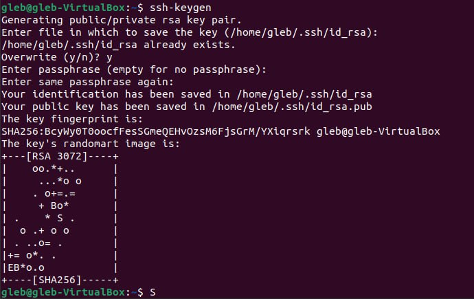
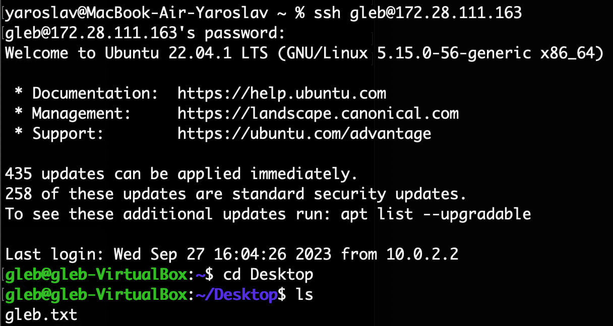
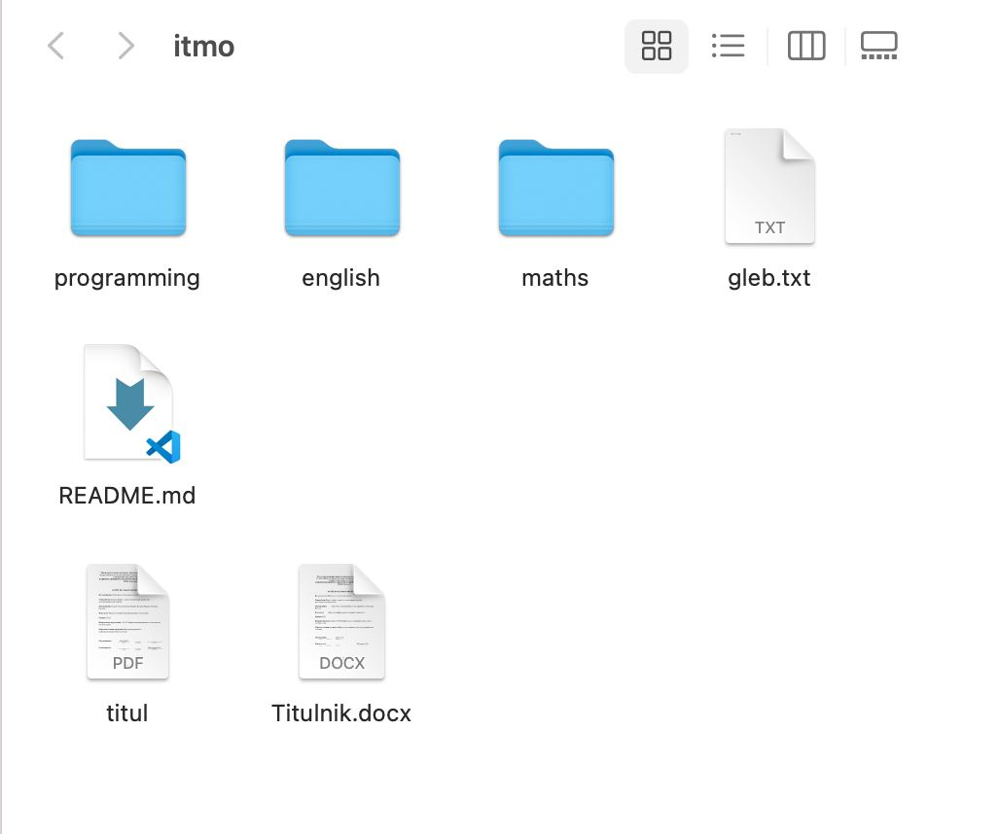

# Лабораторная работа №1

## Условие Лабораторной работы

Имея три компьютера А В и С, находящихся в одной локальной сети, перенести файл с компьютера В на компьютер С, пользуясь терминалом компьютера А.

## Ход работы

Первым делом создадим на компьютере В ключ ssh, для дальнейшего соединения с компьютеором А(Рисунок 1.1)

Далее введём этот ключ на компьютере А и соединимся с компьютеором В(Рисунок 1.2)

После этого проводим аналогичные операции проводим на компьютере С и указанной в описании командой перекидываем файл(Рисунок 1.3)

Результат представлен на рисунке 1.4

