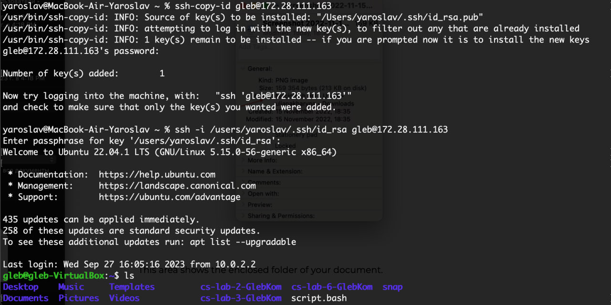

# Лабораторная работа №1

## Условие Лабораторной работы

Имея три компьютера А В и С, находящихся в одной локальной сети, перенести файл с компьютера В на компьютер С, пользуясь терминалом компьютера А.

## Лабораторная без звездочки

Присоединимся по SSH с компьютера A к компьютеру B при помощи пароля. Убедимся, что
на рабочем столе компьютера B есть файл, который нам нужен.

Теперь мы можем управлять компьютером B из терминала компьютера А. Одной командой
перенесем файл gleb.txt с компьютера B на компьютер С при помощи SSH, тоже при помощи
пароля.

## Лабораторная со звездочкой

Сгенерируем на компьютере B публичный и приватный SSH ключи. 

Для компьютера А и С сделаем аналогичную операцию

При помощи этих ключей подключимся к компьютеру B через компьютер А

Перенесем файл с компьютера В на компьютер С аналогично, как в лабораторной без звездочки.

