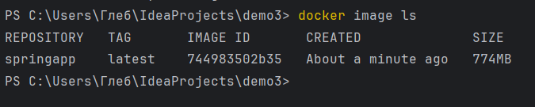
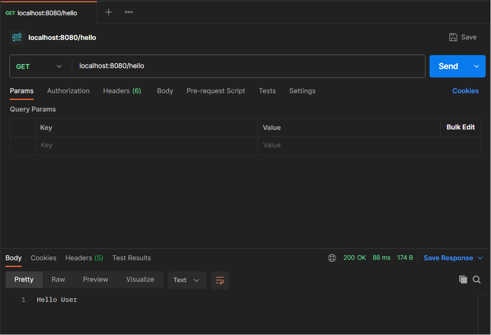

# Пишем плохой Dockerfile

Плохие практики:
1. Использование образа Ubuntu, вместо образа OpenJDK
2. Использование latest, вместо конкретных версий
3. Использование apt get upgrade

Сколько контейнер собирался:

Размер контейнера:

Запуск контейнера:

Проверка работы программы при помощи Postman:

# Пишем хороший Dockerfile

Что исправлено:
1. Вместо образа ubuntu используется openjdk
2. Вместо latest указана конкретная версия opendjkd:17
3. Не используется apt get upgrade

Сколько контейнер собирался:

Размер контейнера:

Запуск контейнера:

Проверка программы при помощи Postman:

Еще плохие практики использования контейнеров:
1. Не надо хранить данные внутри контейнера. В ходе жизненного цикла контейнеры могут приостанавливаться, уничтожаться, заменяться. Если приложение работает в контейнере, то версия 1.0 этого приложения должна легко меняться на версию 1.1 без потери данных и прочих неприятностей.
2. Не надо выполнять в контейнере более одного процесса. Контейнеры идеально приспособлены для выполнения одного процесса (демона http daemon, сервера приложений, СУБД). В противном случае вы можете столкнуться с разного рода неприятностями, типа копания в логах или обновления процессов по отдельности.
